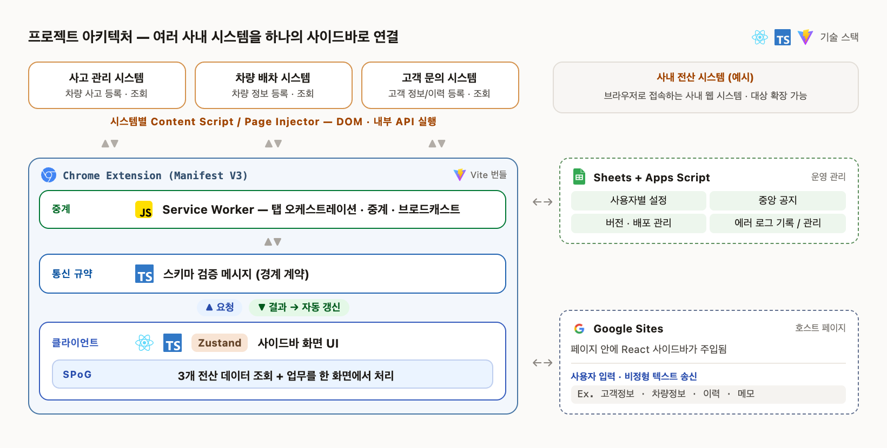

# SPoG Sidebar : 4개 사내 시스템을 하나의 창(Single Pane of Glass)으로 묶는 크롬 확장프로그램

서로 연동되지 않는 4개의 사내 웹 시스템(포털/사고 관리 시스템/차량 배차 시스템/고객 문의
시스템)을 크롬 확장(Manifest V3) 하나로 이어붙여, 화면 전환 없이 사이드바에서 업무를
끝내는 자동화 데모입니다.

> **이 저장소는 전부 모형(mock)입니다.**
> - 연동 대상 네 시스템은 모두 로컬 모의 서버(`localhost:8081~8086`)이며, 실제 연동
>   대상은 이 저장소에 포함되어 있지 않습니다.
> - 시스템명·도메인·엔드포인트·필드명·데이터는 전부 일반화한 가상의 값입니다.
> - `extension/` 아래 소스는 **의사코드**입니다. 흐름과 설계 의도만 남기고 구현
>   디테일은 주석으로 대체했기 때문에 그대로 설치·실행되지 않습니다.
>
> 목적은 "네 개의 분리된 시스템을 사이드바 하나로 묶는 구조"를 보여주는 것입니다.

[사용설명서](https://jy-maru.github.io/spog-sidebar/user-guide.html)는 동일한 구조로
운영한 확장의 화면 흐름을 담고 있습니다(고객정보·식별정보는 마스킹·블러 처리, 시스템명은
일반화). 스크린샷이 포함된 문서는 이 하나뿐이며, 나머지 소스는 위 설명대로 모형입니다.


*원본 화질: [`docs/demo.mp4`](./docs/demo.mp4). 상세 시나리오는 [`docs/ARCHITECTURE.md`](./docs/ARCHITECTURE.md#데모-시나리오) 참고.*

## 기술 스택 & 아키텍쳐




더 깊은 구조(모듈별 파일, 메시지 버스 3단 구조, 탭 오케스트레이션, 설계 결정·알려진
한계)는 [`docs/ARCHITECTURE.md`](./docs/ARCHITECTURE.md)에 정리했습니다.

## 어떤 문제를 해결했나

| 시스템 | 역할 |
|---|---|
| **포털** | 사이드바 로드, 사용자 업무 시작점 |
| **사고 관리 시스템** | 접수 건 등록·조회 |
| **차량 배차 시스템** | 예약, 차량 배정 |
| **고객 문의 시스템** | 고객 문의 이력·응대 메모 |

4개 시스템은 로그인·데이터를 공유하지 않습니다. 이 확장은 각 화면에 자동화 코드를
심어두고, 사이드바 버튼 한 번으로 **필요한 화면을 대신 열어 정보를 채우거나 읽어오고,
결과만 사이드바로 모아** 보여줍니다. 각 단계는 **입력** / **조회**로 구분 표시됩니다.

## 무엇을 자동화했나

| 업무 | 흐름 |
|---|---|
| 접수 건 등록 | 텍스트 정리 → 사고 관리 시스템 폼 자동 입력·제출 → 접수번호 즉시 표시 |
| 배정 등록 | 차량 배차 시스템 폼 자동 채움·제출 → 현황 표에 추가·강조 |
| 예약 등록 → 응대 반영 | 차량 배차 시스템 등록 → 사람 개입 없이 고객 문의 시스템 응대 메모 자동 반영 |
| 가능 차량 통합 조회 | 인접 지역까지 자동 확장 조회 → 거리순 통합 표시 |
| 고객 문의 알림 | 고객 문의 시스템 이벤트 → 사이드바 알림(화면 전환 없이) |
| 처리 이력 기록 | 매 업무 완료 시 자동 기록(감사용) |

**결과물**: 독립 시스템 4개 통합, 자동화 업무 6종, 모듈 27개. 방어 로직 5종(중복요청·
재시도·동시조회·쓰기경쟁·동시스캔)으로 화면 꼬임을 방지합니다.

## 핵심 기능

- 받아 적은 텍스트를 그대로 붙여넣으면 라벨 매칭으로 자동 항목별 정리
- 사람처럼 폼을 하나씩 순서대로 채우고 제출
- 한 시스템 작업이 끝나면 클릭 없이 메시지 버스를 통해 다음 시스템까지 자동 연계
- 화면 구조가 바뀌어도 컬럼 위치가 아닌 제목 텍스트 기반 인식이라 잘 안 깨짐
- Service Worker가 중간에 종료돼도(MV3 cold start) 상태를 복구해 이어서 진행
- 오래된 자동 새로고침 응답이 방금 한 조작이나 최신 화면을 덮어쓰지 않도록 세대
  (generation) 카운터로 방지

## 사이드바 패널

| 패널 | 연동 | 하는 일 |
|---|---|---|
| 게시판 | 포털 | 목록 자동 갱신, 본문은 열 때만 조회. 고정·읽음 실패 시 되돌림 |
| 인바운드 문의 | 고객 문의 시스템 | 알림만 표시(화면 전환 없음) |
| 케이스 처리 | 포털 → 사고 관리 시스템 | 접수양식 자동 정리 → 폼 자동 채움·제출 |
| 예약/배차 자동화 | 차량 배차 시스템 → 고객 문의 시스템 | 배정/예약 자동 등록 + 응대 반영, 후보 검색 |
| 사후관리 | 처리 이력 | 완료 이력 확인 |
| 설정 | — | 환경설정 |

## 디렉터리 구조

```
extension/
  manifest.json                     MV3 매니페스트 (모의 서버 호스트만 등록)
  background/service_worker.ts      백그라운드 허브 — 탭 오케스트레이션·중앙 폴링
  js/
    config.ts                       공유 상수 + 전역 유틸 (import 없이 선번들)
    globals.d.ts                    레거시 전역들의 타입 선언
    portal_entry.js                 포털 진입점 — 초기화 순서만 담당
    ui_controller.js                사이드바 셸 — 패널 전환·토스트·복구
    message_router.ts               메시지 허브 — 스키마·오리진·타임아웃 가드
    case_system_driver.js           케이스 관리 시스템 페이지 자동화
    dispatch_system_driver.js       예약·배차 시스템 페이지 자동화
    customer_system_driver.js       고객 응대 시스템 페이지 자동화
    *_system_interceptor.js         각 페이지 메인 월드에서 fetch 응답만 가로챔
    text_parser.js / dom_parser.js  비정형 텍스트·HTML 표 파싱
    candidate_search.js             거리 계산·후보 스코어링 (DOM 비의존 순수 함수)
    state/                          Zustand 공유 상태 + 구버전 호환 파사드
    panels/                         React 패널 6종
  backend/mock_sidebar_webhook.js   백엔드 웹훅 모형
docs/                               데모 영상 + 아키텍처 문서 + 사용설명서
```

파일명은 전부 "어느 시스템의 무슨 역할인지"가 드러나도록 지었습니다. 같은 시스템을
다루는 `*_driver`(격리 월드에서 페이지를 조작)와 `*_interceptor`(메인 월드에서 응답을
가로챔)가 짝을 이룹니다.

각 파일은 머리말에 "이 파일이 보여주는 것"을 한 줄로 적어두었습니다. 전체를 순서대로
읽고 싶다면 `service_worker.ts`(허브) → `message_router.ts`(검증) →
`*_system_driver.js`(자동화) → `state/`(동시성) 순서를 권합니다.

## License

[MIT](./LICENSE)
