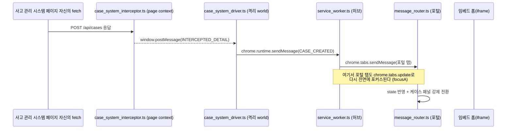
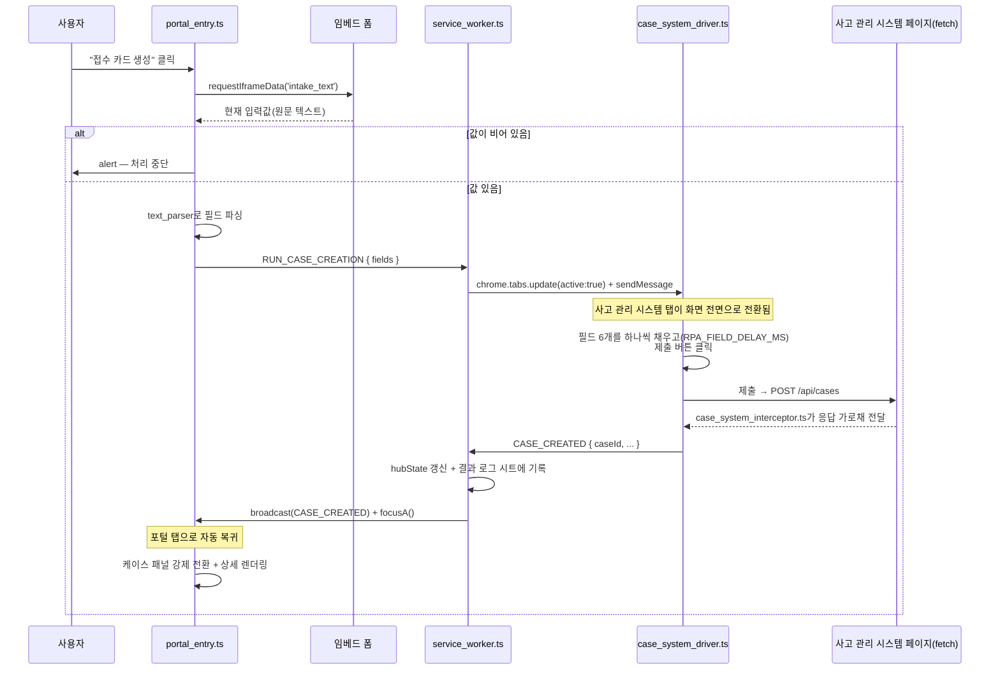

# 아키텍처 상세

> [README.md](../README.md)의 요약을 읽고 오면 이해하기 쉽습니다. 아래는
> `extension/` 소스(파일명·메시지 타입·함수명)를 기준으로 설명합니다.

> **전부 모형(mock)이고, 소스는 의사코드입니다.** 이 문서에 나오는 네 시스템·
> 엔드포인트·데이터는 모두 로컬 모의 서버(`localhost:8081~8086`)를 가리키는 가상의
> 값이며, 실제 연동 대상은 이 저장소에 포함되어 있지 않습니다. `extension/` 아래
> 파일들은 흐름과 설계 의도만 남긴 의사코드라 그대로 실행되지 않습니다 — 각 파일은
> "이 구조가 어떤 문제를 푸는가"를 보여주는 데 필요한 만큼만 담고 있습니다.

## 파일 네이밍 규칙

파일명이 곧 "어느 시스템의 무슨 역할인지"입니다.

| 접미사 | 실행 위치 | 역할 |
|---|---|---|
| `*_system_driver.ts` | 대상 페이지의 격리 월드(isolated world) | 폼을 채우고 버튼을 누르는 자동화 |
| `*_system_interceptor.ts` | 대상 페이지의 메인 월드(MAIN world) | 페이지 자신의 `fetch` 응답만 가로채 릴레이 |
| `portal_entry.ts` | 포털 페이지 | 초기화 순서만 담당하는 진입점 |
| `config.ts` / `globals.d.ts` | 공용 | 공유 상수·유틸과 그 전역 타입 선언 |

`case` / `dispatch` / `customer` 접두사가 각각 케이스 관리·예약·배차·고객 응대
시스템에 대응합니다.

## 핵심 설계 아이디어

1. **각 화면의 자동화 코드는 서로의 존재를 모릅니다.** "이런 일이 생겼다"고 백그라운드
   허브에 알릴 뿐, 어느 화면에 어떻게 전달할지는 허브가 정합니다 — 시스템 하나가
   추가·변경돼도 다른 시스템 코드를 안 건드려도 됩니다.
2. **사이드바가 있는 화면은 역할별로 잘게 나눴습니다.** 코드량이 가장 많은 곳이라
   상태·텍스트 인식·메시지 처리·화면 그리기를 파일 단위로 분리했습니다.

## 1. 계층별 기술 스택

| 레이어 | 파일 | 스택 | 이유 |
|---|---|---|---|
| 제3자 페이지 자동화 | `case/dispatch/customer_system_driver.ts` | TypeScript (프레임워크 없음) | 대상 페이지 안에 주입되는 코드라 UI 프레임워크를 못 씀 — 타입만 가져간다 |
| 백그라운드 허브 | `background/service_worker.ts` | TypeScript | 메시지 타입·탭 오케스트레이션이 늘어나 타입 검사가 필요해진 레이어 |
| 사이드바 UI | `panels/*.tsx` | React 19 + TypeScript | 패널별 로컬 상태·리렌더링 관리 |
| 공유 상태 | `state/store.ts` | Zustand 5 | 여러 패널이 구독하는 전역 상태, `subscribe()` 지원 |
| 추적 상태 | `state/tracking_store.ts` | Zustand 5 | 폴링(스캔)으로만 확인 가능한 외부 데이터를 톰스톤+스코프 한정 병합으로 깜빡임 없이 추적 |
| 게시판 상태 | `state/bulletin_store.ts` | Zustand 5 | 낙관적 업데이트 + 실패 시 롤백, 본문 온디맨드 조회 |
| 레거시 호환 파사드 | `state/legacy_adapter.ts` | TypeScript | 기존 호출부가 옛 `window.StateManager.get/set` API를 그대로 쓸 수 있게 함 |
| 메시지 검증 | `message_router.ts` | TypeScript + zod | 메시지 타입별 스키마 검증 + 3단계 오리진 검증(self/embed-sandbox/trusted-list) |
| 백엔드(경량) | `backend/mock_sidebar_webhook.ts` | TypeScript | 스프레드시트+스크립트 런타임 흉내 — 목록/본문 이중 캐시, 멱등 쓰기 핸들러 |

## 2. 모듈 구조 (포털 탭 기준)

순수 JS 콘텐츠 스크립트 셸 위에 패널을 하나씩 React + TypeScript + Zustand로 옮겨가는
점진적 마이그레이션 구조를 그대로 반영했습니다.

| 계층 | 파일 | 스택 | 책임 |
|---|---|---|---|
| Config | `config.ts` | TS | 도메인 상수, 타임아웃 값을 `Object.freeze`로 동결해 `globalThis`에 등록. 타입은 `globals.d.ts`가 전역으로 노출 |
| State (store) | `state/store.ts` | TS + Zustand | `createStore`로 만든 공유 상태 스토어 |
| State (호환 파사드) | `state/legacy_adapter.ts` | TS | 구버전 API를 재현해 기존 호출부를 안 건드림 |
| State (배선) | `state/index.ts` | TS | `window.StateManager`/`window.ResourceStore` 전역 등록 |
| State (훅) | `state/hooks.ts` | TS + React | `useSharedStore` — 패널이 공유 스토어를 구독하는 훅 |
| Parsers | `text_parser.ts` | TS | 비정형 접수양식 텍스트를 라벨 매칭으로 구조화 필드로 변환 |
| Parsers | `dom_parser.ts` | TS | 다른 시스템의 HTML 표를 헤더 텍스트로 동적 매핑 |
| Domain engine | `candidate_search.ts` | TS | 거리 계산·후보 필터링·스코어링만 담당하는 순수 함수(DOM 비의존) |
| Bridge / Bus | `message_router.ts` | TS + zod | 타입드 메시지 레지스트리 — 스키마·오리진·타임아웃 가드를 한 곳에서 담당 |
| Panels | `js/panels/*.tsx` (6개) | TS + React + Zustand | 패널별 컴포넌트 + 전용 로컬 스토어 |
| UI 셸 | `ui_controller.ts` | TS | 인터럽트 vs 앰비언트 판단, MV3 재시작 복구 — React로 안 옮겨진 레거시 코어 |
| Entry point | `portal_entry.ts` | TS | `MessageRouter.init()` → `UiController.init()` 순서로 초기화만 수행 |

```
config → state/store → state/legacy_adapter → state/index
       → text_parser → dom_parser → candidate_search
       → message_router → ui_controller → panels/*(React 마운트)
       → portal_entry(init 호출)
```

Manifest V3 서비스워커는 파일 하나만 등록할 수 있어, `background/service_worker.ts`는 빌드 시 config 모듈을 함께 번들해 같은 상수를 공유합니다.

### config는 import 없이 IIFE로 선번들한다

`config.ts`는 `content_scripts` 목록의 **첫 항목**으로 로드되고, 뒤따르는 스크립트들이
로드 직후 `globalThis.RPA_APP_CONFIG`를 동기적으로 읽습니다. 그런데 엔트리 파일에
`import` 문이 하나라도 있으면 번들러(crxjs 등)는 그 엔트리를 **비동기 로더**로 바꿔
출력합니다. 그러면 config가 전역을 심기 전에 다음 스크립트가 먼저 실행돼 경쟁이
생깁니다.

그래서 `config.ts`만은 import 없이 작성하고 IIFE로 선번들해 동기 로드를 보장합니다.
타입은 `import`가 필요 없는 `globals.d.ts`의 `declare global`로 공유합니다.

## 3. 메시지 버스: 3단 구조

브라우저 확장의 격리된 실행 컨텍스트 제약 때문에 통신 계층이 3단으로 나뉩니다.



**3-1. 페이지 컨텍스트 ↔ 콘텐츠 스크립트** — 콘텐츠 스크립트는 격리된 월드(isolated world)에서 실행되어 페이지의 `window.fetch`에 접근할 수 없습니다. `<script src="...">`로 페이지 컨텍스트(MAIN world)에 스크립트를 주입해 `fetch` 응답을 가로채고, `window.postMessage`로 되돌려줍니다.

```js
// case_system_interceptor.ts — 페이지 컨텍스트(MAIN world)에서 실행
const originalFetch = window.fetch
window.fetch = async (...args) => {
  const response = await originalFetch(...args)
  if (isCaseDetail(urlOf(args)) && response.ok) {
    const payload = await response.clone().json()   // clone — 페이지 쪽 소비를 방해하지 않는다
    window.postMessage({
      type: 'INTERCEPTED_CASE',
      payload: pickNeededFields(payload),           // 필요한 필드만 넘긴다
    }, location.origin)                             // 와일드카드 대신 자기 오리진으로 한정
  }
  return response
}
```

**3-2. 콘텐츠 스크립트 ↔ 임베드 iframe** — 포털 페이지엔 접수양식 폼이 iframe으로 임베드돼 있습니다. 별도 요청 ID 체계 없이 **"kind로 매칭 + 타임아웃 시 null 반환"**하는 Promise 래퍼로 요청/응답을 짝짓습니다(동시 1건 대기 전제 — §9 참고). iframe은 별도 샌드박스 도메인이라 `validatePostOrigin(event, 'embed-sandbox')`로 오리진을 검증한 뒤에만 신뢰합니다.

```js
// message_router.ts
function requestFromEmbedFrame(kind, timeoutMs) {
  return new Promise((resolve) => {
    const timer = setTimeout(() => { cleanup(); resolve(null) }, timeoutMs)
    function onMessage(event) {
      if (!isAllowedOrigin(event.origin, 'embed-sandbox')) return
      const msg = event.data
      if (msg?.type === 'RESPONSE_DATA' && msg.kind === kind) {
        clearTimeout(timer); cleanup(); resolve(msg.payload)
      }
    }
    function cleanup() { window.removeEventListener('message', onMessage) }
    window.addEventListener('message', onMessage)
    embedFrameWindow.postMessage({ type: 'REQUEST_DATA', kind }, '*')
  })
}
```

**3-3. 콘텐츠 스크립트 ↔ 백그라운드 ↔ 다른 탭 — 허브 앤 스포크** — 서로 다른 탭의 콘텐츠 스크립트는 직접 통신할 수 없어, 백그라운드 서비스워커가 허브 역할을 합니다.

```js
// background/service_worker.ts — 타입별로 개별 리스너를 등록하는 방식
chrome.runtime.onMessage.addListener((msg, sender, sendResponse) => {
  if (msg.type !== 'INTERCEPTED_CASE') return false
  broadcastToPortal(msg) // 포털 탭 전체에 push
  sendLog({ step: 'case_created', caseId: msg.caseId, at: new Date().toISOString() })
  return false
})
```

수신 측(`message_router.ts`)은 타입드 레지스트리로 분배 — 새 이벤트는 등록 한 줄만 추가하면 됩니다.

```js
// message_router.ts
register('INTERCEPTED_CASE', CaseSchema, handleInterceptedCase)
```

> `service_worker.ts`는 시스템 간 중계를, `message_router.ts`는 스키마·오리진·타임아웃 가드를 담당합니다 — 두 계층의 책임이 다르므로 분배 방식도 다릅니다.

## 4. 상태 관리: 2단 상태 설계

- **탭 로컬 상태** (`state/store.ts`) — 새로고침하면 사라지는 휘발성 상태.
- **허브 상태** (`service_worker.ts`의 `hubState`) — 여러 탭에 걸쳐 지속돼야 하는 진행 상태. MV3 서비스워커는 유휴 시 언제든 종료(cold start)될 수 있어, 각 스텝이 끝날 때마다 재broadcast하고 포털은 로드 시 `REQUEST_STATE`로 다시 물어 복구합니다.

```ts
// state/legacy_adapter.ts — 화이트리스트 가드가 있는 구버전 호환 파사드
export const legacyStateManager = {
  get(key: string) { _guard(key); return sharedStore.getState()[key as StateKey] },
  set(key: string, value: unknown) { _guard(key); sharedStore.setState({ [key]: value }) },
  update(key: string, partial: object) { /* 객체 상태만 부분 병합 — 배열/원시값이면 경고 후 무시 */ },
}
```

## 5. 탭 라이프사이클 오케스트레이션

백그라운드는 필요한 탭이 없으면 대신 열어주는 오케스트레이터이기도 합니다. 대상 탭을 **전면으로 가져와** 처리 과정을 보여주고, 완료되면 원래 탭으로 자동 복귀합니다.

```js
// background/service_worker.ts — find-or-create-tab 패턴
function runOnSystem(system, command) {
  const tab = findTab(system)
  if (tab) {
    focus(tab)                                   // 처리 과정을 사용자에게 보여준다
    relayOrRecover(tab, command, LABEL[system])  // 실패하면 새로고침 + 사이드바에 알림
    return
  }
  openTab(system, () => relay(findTab(system), command)) // 로드 완료를 기다렸다 전송
}
```

## 6. 사이드바 UI 인디케이터

1. **뱃지(badge)** — 비활성 패널에 처리 대기 건수를 숫자로 표시.
2. **트래킹 닷(track-dot)** — 열려 있지 않은 패널에 영향을 주는 이벤트가 오면 점으로 표시.
3. **쓰기/읽기 태그(kind-tag)** — `쓰기` / `읽기`로 구분.

**인터럽트 기반 자동 전환**: 핵심 이벤트(접수 카드 생성)는 강제로 패널을 전환하고, 부차적 이벤트(인바운드 콜백)는 뱃지만 올립니다.

```js
// ui_controller.ts
function onCaseConnected() {
  switchPanel('panel-case', { forced: true })
}
function onInboundCountUpdated(count) {
  Panels.inboundActions.setBadgeCount(count)
}
```

## 7. 엔드투엔드 예시: 접수 카드 생성



"값이 비어 있으면 중단"은 시스템 간 공유 트랜잭션이 없기 때문에, 확장 스스로 정합성을 검증하고 불일치 시 자동화를 중단시키는 방어 로직입니다.

## 8. 설계 결정과 트레이드오프

| 결정 | 이유 |
|---|---|
| 콘텐츠 스크립트 간 직접 통신 금지, 백그라운드 허브 강제 | 탭 간 결합도를 낮춰 "차량 배차 시스템 어댑터가 사고 관리 시스템의 존재를 몰라도 되게" 만듦 |
| `Object.freeze`로 동결된 단일 config 모듈 + `globalThis` 공유 | 서비스워커/콘텐츠 스크립트 양쪽에서 같은 상수를 참조, 중복 방지 |
| 상관관계 ID 없는 Promise+타임아웃 기반 iframe 요청 | 동시 1건 대기 전제하에 충분히 안전하고, 요청-ID 체계보다 단순 |
| 상태 스토어의 화이트리스트 가드 | TS 없이도 오타로 인한 "조용한 실패"를 콘솔 경고로 드러냄 |
| 백그라운드가 진행 상태를 재broadcast | MV3 서비스워커 재시작을 전제로, UI가 "다시 물어서" 복구 |
| 순수 도메인 로직을 DOM 파서와 분리 | 거리/스코어링 로직이 DOM 없이도 테스트 가능해야 한다는 원칙 |
| 대상 탭을 항상 전면으로 가져와 처리 | 자동 연쇄까지도 탭 전환으로 보여주는 게 시스템 통합을 드러내는 데 중요 |
| 후보 검색: 잠금 대신 세대(generation) 카운터 | 응답 대기 중 다음 요청이 가면 이전 응답은 이미 쓸모없어짐 — 잠그는 대신 세대 번호로 오래된 응답을 가려냄 |
| 게시판 쓰기를 허브 경유 강제 + 쓰기 세대 카운터 | 직접 쓰기 구조에선 배경 폴링과의 순서 보장이 불가능 — 쓰기 시작마다 세대 번호를 올려 그 이전 폴링 응답을 무효화 |
| 추적 목록은 "스코프 한정 병합"으로 갱신 | 서로 다른 스캔 결과가 상대의 발견을 지워버리지 않도록, 실제로 훑은 범위 밖은 건드리지 않음 |

## 9. 이 저장소의 범위

- **의사코드** — `extension/` 아래 파일은 흐름과 설계 의도만 담고 있어 그대로 실행되지 않습니다. 구현 본문은 주석으로 대체했습니다.
- **모듈 로딩** — 레거시 스크립트는 전역 네임스페이스를 통해 서로를 참조하고, 로드 순서는 `manifest.json` 배열이 정합니다. 실제 배포에서는 번들러가 이 순서를 고정합니다.
- **테스트** — 의사코드라 실행 테스트가 없습니다. 실제 구현으로 옮긴다면 DOM에 의존하지 않는 부분(`candidate_search.ts`의 거리·스코어링)이 먼저 테스트 대상이 됩니다.
- **임베드 브리지** — 동시 1건 대기를 전제로 한 단순화입니다. 동시 다발 요청이 필요한 환경이라면 상관관계 ID를 도입하는 설계가 됩니다.

## 데모 시나리오

1. 사이드바가 포털에 자동 주입되고 "케이스 처리" 패널이 기본 활성화됩니다.
2. 임베드된 폼에 접수양식 텍스트를 붙여넣습니다.
   ```
   고객명: 홍길동
   연락처: 010-1234-5678
   식별코드: AB-1234
   접수일시: 2026-07-25 14:30
   위치: 서울시 강남구
   상세내용: 일반 문의 접수
   ```
3. "접수 카드 생성"(쓰기) 클릭 → 사고 관리 시스템 탭으로 전환되며 폼 필드가 순서대로 채워지고 제출됩니다. 완료되면 사이드바로 자동 복귀하고 접수 카드 번호가 표시됩니다.
4. "예약/배차 자동화" 패널에서 "블록 생성"(쓰기) → "후보 검색"(읽기) 클릭 → 차량 배차 시스템 탭으로 전환되어 값이 채워지거나 결과가 조회되고, 끝나면 사이드바로 복귀합니다. 방금 생성한 블록은 현황 표에 새 행으로 추가돼 잠깐 강조됩니다. 후보 검색을 빠르게 두 번 눌러도 표는 항상 마지막 요청의 결과만 반영합니다.
5. "고객 예약 생성"(쓰기) 클릭 → 차량 배차 시스템에서 예약이 생성되고 사이드바로 복귀합니다. 곧이어 **클릭 없이** 고객 문의 시스템 탭으로 전환되어 응대 메모에 예약정보가 자동으로 채워지고 다시 사이드바로 돌아옵니다.
6. 고객 문의 시스템에서 인바운드 콜백이 발생하면 패널을 강제로 바꾸지 않고 뱃지만 올립니다.
7. 모든 스텝이 결과 로그 시트에 자동 기록된 것을 확인합니다.
